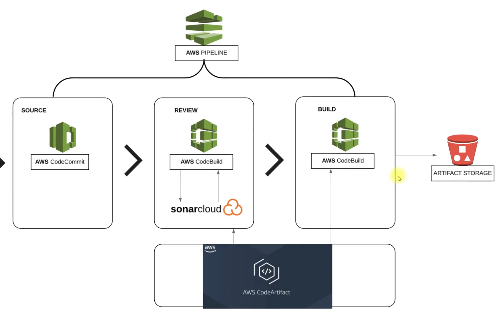

## Continous integration project set up using AWS services, Code build, Code artifacts, Code pipeline, Code deploy, Sonarqube Cloud

- This project involves setting up of a continous integration pipeline for v-profile application written in Java. We would be using the below AWS web services for this project:

    - Code Commit 
    - Code Build
    - Code Artifacts
    - Code Pipeline
    - Code Deploy 
    - S3 storage
    
## Project Architecture 



## Project Steps 

1) Create a Code commit repository and configure it to connect from your local PC terminal. We would be using SSH connection

```bash
aws codecommit create-repository --repository-name pumej-vprofile-repo --repository-description "Repository for vprofile java project"
ssh-keygen -t rsa -b 4096 -C "pumej-codecommit" -f ~/.ssh/vpro-codecommit_rsa
cat ~/.ssh/vpro-codecommit_rsa.pub                                  | Cat the pub key and upload it under the SSH section of your IAM user. 
nano ~/.ssh/config                                                  | Create a ssh config file for codecommit and update file with the generated ssh key from console. 
ssh git-codecommit.us-east-1.amazonaws.com                          | Use this to confirm authentication to the repo. 
```